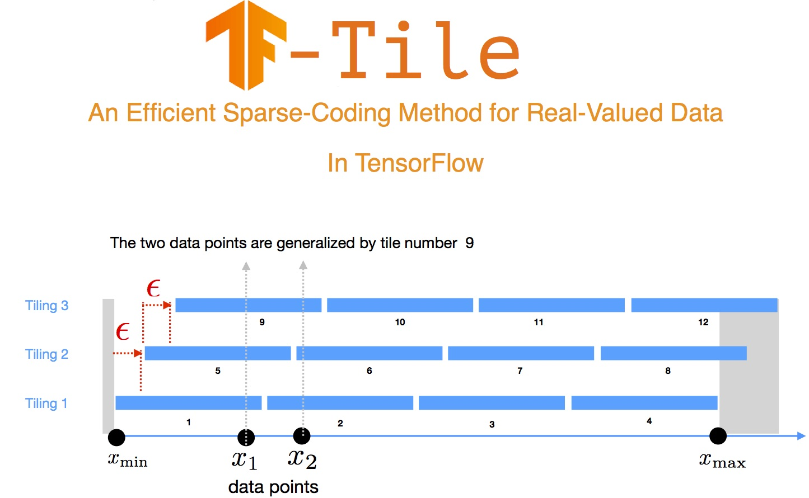

Tile-Coding in TensorFlow ---a sparse-coding tool for generating features from real-valued data



Steps to run the example:
```
1. create virtual environment (for example called tf-tile) for python using conda: a) install conda, then b) conda create -n tf-tile python=3.6 
2. conda activate tf-tile
3. cd tf-tile directory and  pip install -r requirements
4. cd examples
5. python winequality_example.py 
```

Here, we show how to use tile-coding in your TF code through an example. We use winequality UCI as an example, where the real-valued feature-names are as follows:

```
FEATURES = ['fixed_acidity','volatile_acidity','citric_acid','residual_sugar','chlorides','free_sulfur_dioxide', 'total_sulfur_dioxide','density','pH','sulphates','alcohol']
```

The first step is to decide how to descritize the real-valued data and choose the number of buckets num_buckets (e.g. 10) and thus boundaries. We assign a class 
to this step called TileStrategy. The usual strategy is uniform but the user can assign different tiles using data statistics (custom tiles).

```
tile_strategy_boundaries = TileStrategy(feature_range).uniform(num_buckets) #or build your own custom tiling strategy, for example using kernel desnsity estimation 
```


Then the second stage will be tiling the data given tile_strategy_boundaries, which is a dictionary holding boundaries for each feature. For tilings we can set
a suitable value for num_tilings (e.g. 10) and  for more information on tilings you may visit: https://confluence.criteois.com/display/~h.maei/Tile-Coding%3A+An+Efficient+Sparse-Coding+Method+for+Real-Valued+Data#link-talk-213056

```
tilings = Tilings(tile_strategy_boundaries,num_tilings)
```

Now following the classical template used in tensorflow for estimator class we compute input functions with tiled features. For example,

```
input_fn_train = get_input_fn(train, batch_size,tilings)
input_fn_eval = ...
```
Once the custom model function is built (again see the example), 

```
tiled_feature_column_list = TiledFeatureColumns(tilings).get_list()
params                    = {
                            'feature_columns': tiled_feature_column_list,
                            'hidden_units': None,
                            'num_classes': winequality.get_n_classes()
                            }
```

and now everything should be ready for training:

```
estimator = tf.estimator.Estimator(model_fn=model_fn, params=params, model_dir=MODEL_DIR)
train_spec= tf.estimator.TrainSpec(input_fn=input_fn_train,max_steps=40000)
eval_spec = tf.estimator.EvalSpec(input_fn=input_fn_eval ,steps=100,start_delay_secs=0,throttle_secs=30)
tf.estimator.train_and_evaluate(estimator,train_spec, eval_spec)
```

