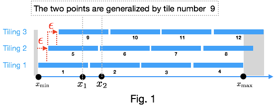
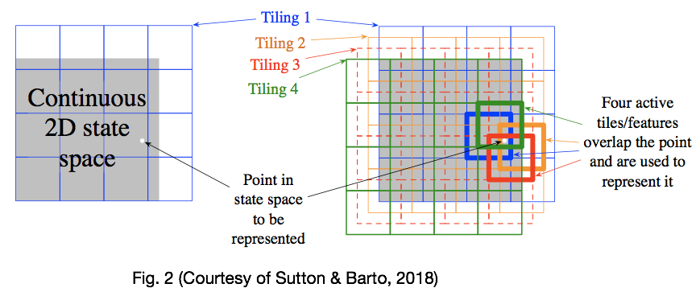
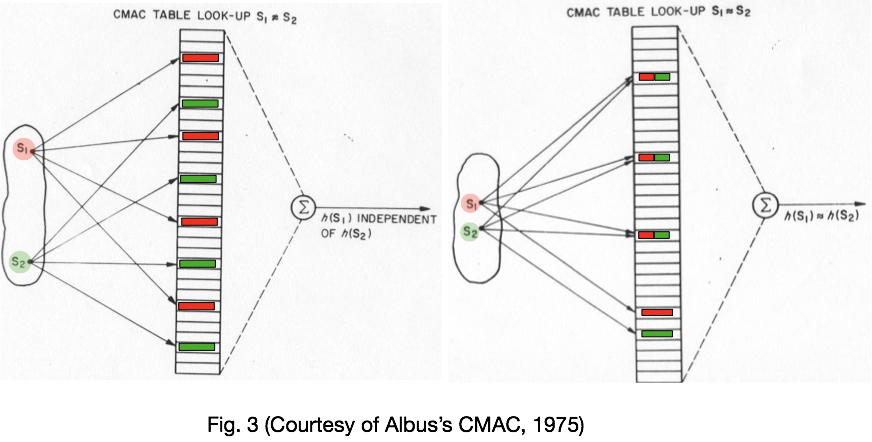
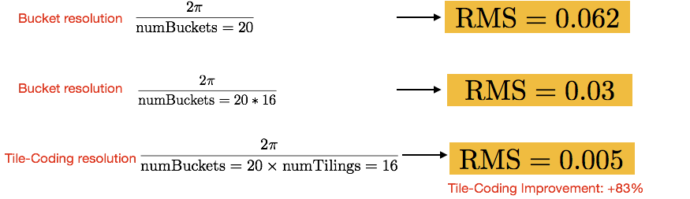
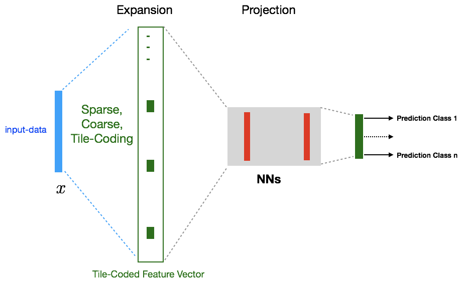
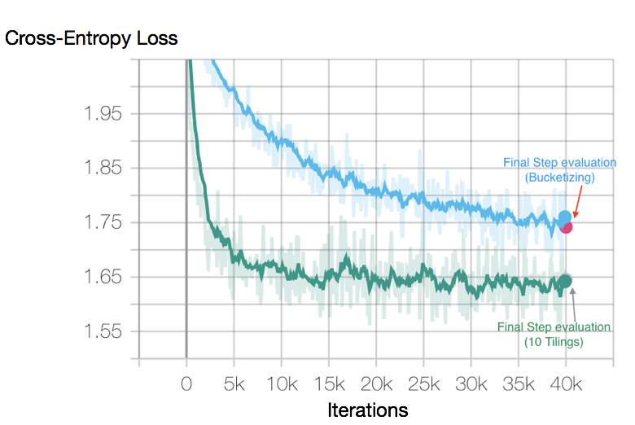

Tile-Coding: An Efficient Sparse-Coding Method for Real-Valued Data
===================================================================

Author: Hamid Maei

Introduction
------------

Arguably the most important problem in machine learning (ML) is representing raw input data such that it can be used
for reliable predictions. Such representation  often is presented as a *feature vector*, that can be used for training
the model. With the advent of Deep Neural Networks (DNNs) such as Convolutional Neural Networks (CNNs), generating such
features is becoming more automated due to end-to-end training. The same story applies  in Natural Language Processing
(NLP). Unlike data used in NLP and Computer Vision, in many cases the data is not structural and homogeneous
(multi-modal). For example, in Ad Tech data logs store a combination of categorical and real-valued feature variables
for predictions-- a feature variable might denote click-through-rate (CTR) since last week, and another one could
represent Age or Geo-Location of the user. The same story is true in a wide range of problems with multi-modal
variables from robotics to weather forecasting,  etc.

The question which we would like to address here is how such diverse form real-valued data can be represented as input
to ML models such as LR/DNNs? 

An immediate data normalization approach, which often has been used due to its simplicity, is discretizing the
real-valued features, also called *Bucketization*; that is, a real-valued input is transformed into a binary feature
vector whose elements are zero except the one corresponding with the bucket where the value falls into.
This *sparse-coding  *not only normalizes the input data but also projects the data into a large dimensional space
(the total size of buckets) and as such the generalized linear models, such as LR, will become effective for
predicting highly non-linear functions (please see a toy example bellow). However, bucketizing the input data has
several drawbacks as follows, which we aim  to solve in this blog: 

1) It can have a large prediction error due to the resolution of bucket-size.
2) The dimensionality of feature-vector, and thus model-size, increases if a much lower resolution has been selected
for the bucket-size.
3) It lacks generalization as we explain in Fig. 1.

An alternative idea to address the above issues is what is called as *Tile-Coding–a sparse-coding method that
generalizes to neighboring points.* Fig.1 shows how tile-coding works in 1-dimension. Consider a feature
variable *x* that resides in the interval *\[xmin xmax\]*
The discretization step (called Tiling 1 in Fig.1 ) divides the interval into 4 buckets and as such
*x1* is represented by the binary vector *\[1,0,0,0\]* and *x2*
is represented by *\[0, 1,0,0\]*. For clarity, let us represent the two vectors by their sparse-representation in the
form of *x1 = \[1\]* and *x2 = \[2\]*,
where each element of the array indicates the index of the bucket where the value falls into.
Using tile-coding idea, now we shift all the buckets (shown in Tiling 1) by some small amount and generate Tiling 2
and stack it on Tiling 1 as is depicted in Fig. 1. Now we have *x1 = \[1, 5\]* and
*x2 = \[2, 6\]*. So far *x1* and *x2*
have no relationship in their features through the generated buckets. Now we do one more shift on the Tiling 2 and
generate Tiling 3 and stack it on Tiling 2. Now the representations become
*x1 = \[1, 5, 9\]* and *x2 = \[2, 6, 9\]*. Suddenly, with Tiling 3,
*x1* and *x2*
become related  through  the tile index 9. *This is the key to generalization between the two neighboring points.* As
we can see the dimensionality of the resulting feature vector is multiplied by 3 compared to the original
bucketization (Tiling 1), but as we will see later, it still can provide a better performance even if we decided to
reduce the bucket resolution by the factor of 3. 

The tile-coding idea we explained above can be extended to inputs with multiple feature variables. For example,
Fig. 2 shows how to do tile-coding for 2-dimensional case. As we get more and more feature-variables we will face
the curse-of-dimensionality, but this problem can be remedied through hashing or tiling or individual or pairs
of features as we explain later.

The idea of tile-coding, historically, goes back to Albus's Cerebellar Model Arithmetic Computer (CMAC)
[\[1975\]](http://wrcooke.net/classiccomputer/robot_brains/albus/byte_albus.html), as
a model designed for learning in neural networks (NNs). Fig. 3, shows how similar patters (S1 and S2 ) share similar
representations.

A toy example: predicting a non-linear function with tile-coding and linear regression
--------------------------------------------------------------------------------------

Let us start with a toy example before using a real-world dataset to show the effectiveness of tile-coding compared
to bucketization method. Here, we like to use tile-coding in conjunction with linear regression to estimate a highly
non-linear function as an example we try to learn the function, *y=sin(x)*.
Thus, we consider the problem as supervised linear regression and use simple gradient-descent to learn the weights.
Ultimately we use  root-mean-square error as our metric. Bellow we observed that tile-coding is much more efficient
that bucketization method even for the case where the size of the feature-vector --model size–is the same for
both (20x16).

Dealing with the curse-of-dimensionality as feature-variables increase
----------------------------------------------------------------------

Tile-coding, the way was described above is subject to the curse-of-dimensionality as number of variables increases.
There are two effective methods to deal with this problem: 1) by introducing hashing and thus collisions we can limit
the memory size allocations, 2) instead of tiling all the joint variables we can tile only each individual or pairs
of individuals (known as feature crossing which consider second order non-linearities). Due to sparse representations,
empirically we have observed the effectiveness of such approximations to deal with the curse-of-dimensionality.
In addition, as the figure below demonstrates, one can also use it in conjunction with DNNs hoping that the middle
hidden layers will be able to find higher levels of correlations.

Empirical results on a real data-set
------------------------------------

Here we use [wine-quality UCI dataset](https://archive.ics.uci.edu/ml/datasets/wine+quality)
The dataset is consist of 11 real-valued feature variables as is shown bellow labeled with the score quality
between 0 to 10.  As we can see the feature variables are multi-modals with different unit values. Thus, for a
better performance, we would need to to normalize them before using a simple logistic regression method.
We have considered red-wine dataset as a classification problem and since there is overlapping between the labels,
due to quality scoring, the problem is fairly hard. One way to enhance prediction, for identifying high quality vs
low quality, is to bucketize the score values in three buckets of high, medium and and low quality and remove the
medium quality dataset and turn the problem into a binary classification problem. However, here we use 10 classes
as labels and aim to show how the value of tile-coding vs bucketization for this complex case. We use the classical
cross-entropy loss function as out metric.

&nbsp; | fixed acidity | volatile acidity | citric acid | residual sugar | chlorides | free sulfur dioxide | total sulfur dioxide | density | pH   | sulphates | alcohol
------ | ------------- | ---------------- | ----------- | -------------- | --------- | ------------------- | -------------------- | ------- | ---- | --------- | -------
min    | 4.6           | 0.12             | 0           | 0.9            | 0.012     | 1                   | 6                    | 0.99007 | 2.74 | 0.33      | 8.4
max    | 15.9          | 1.33             | 1           | 9              | 0.27      | 68                  | 165                  | 1.00369 | 4.01 | 1.36      | 14.9

After splitting the dataset into 70%-30% for train-test, we conducted both bucketiziation and tile-coding on each
feature variable and used 10 tilings. We trained Logistic Regression with AdagardOptimizer on TensorFlow, using
the Tile-Coding mechanism we developed.   As the plot, bellow, shows not only we get a significant improvement
(+10% without tunings efforts and it can be improved further), but also we observe there is a significant convergent
rate when tile-coding  is used. We think it is due to its ability to generalize learned model across neighboring points.   

References
----------

1) Albus J S (1975), A new approach to manipulator control: The cerebellar model articulation controller (CMAC).
*Trans. ASME, J. Dyn. Syst., Meas., Contr.* 97:220–227
2) Sutton and Barto (2018), Introduction to Reinforcement Learning. MIT Press.
